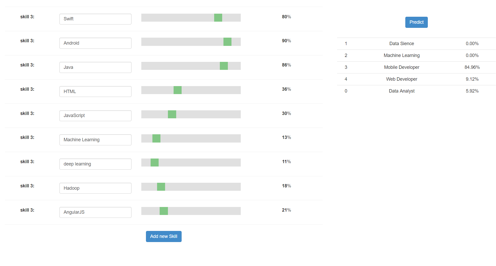

# in this app the user select the skills that he has and select a level for each skill and the app will predict a list of job  sorted from the the most suitable job for him to the less one
i used keras to build the model and flask to deploy the model as rest api 

  
